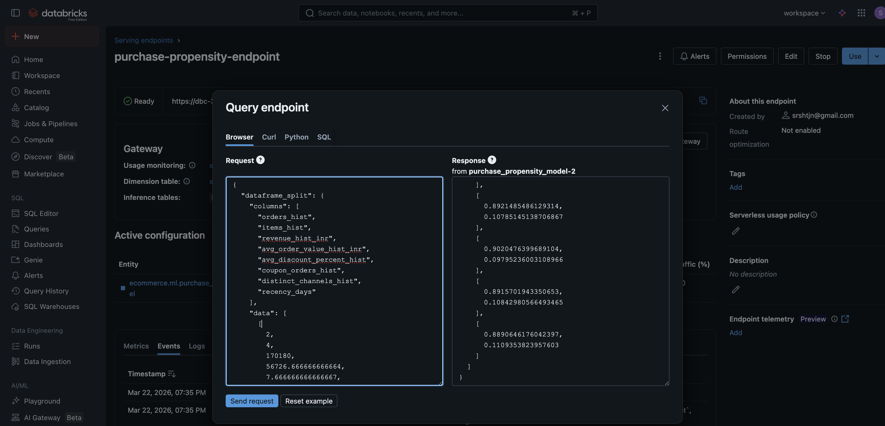
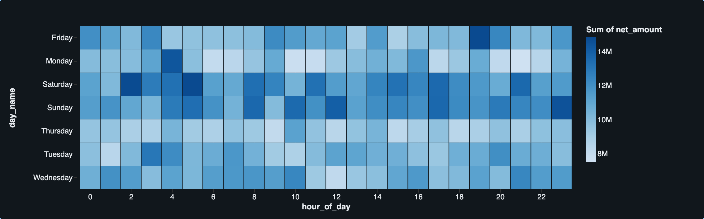
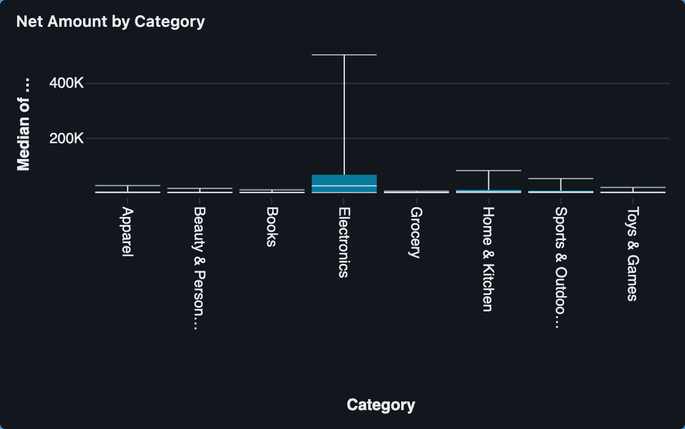
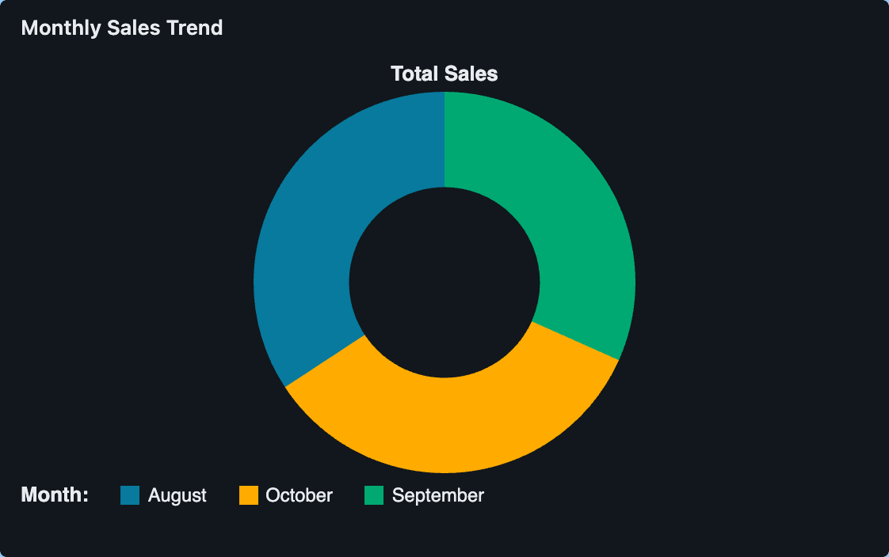

# E-Commerce Data Engineering on Databricks

This project implements a robust **Medallion Architecture (Bronze, Silver, Gold)** on Databricks to process and analyze e-commerce data. It ingests raw data files, standardizes and cleans them, and transforms them into business-ready dimension and fact tables for BI and Analytics.

## Project Overview

The data pipeline processes several key e-commerce entities:
- **Dimensions**: Brands, Categories, Products, Customers, Calendar (Dates)
- **Facts**: Order Items (Transactions)

### Technology Stack
- **Compute / Platform**: Databricks
- **Processing Engine**: Apache Spark (PySpark)
- **Storage Format**: Delta Lake
- **Source Data**: Raw CSV files stored in Databricks Volumes (`/Volumes/ecommerce/source_data/raw/`)

---

## Architecture Layers

### Bronze Layer (Raw Data Ingestion)
The Bronze notebooks ingest raw CSV files from the Databricks Volume and write them as Delta tables in the `ecommerce.bronze` schema without altering the original data structure. 
- Schema inference is applied, but data types remain mostly as strings.
- System metadata columns like `_source_file` and `ingested_at` are added to track data lineage.
- **Notebooks**: `1_dim_bronze.ipynb`, `1_fact_bronze.ipynb`

### Silver Layer (Cleaned & Conformed Data)
In the Silver layer, data from the Bronze tables is cast to the appropriate types, cleaned, and standardized.
- Nulls are handled and data validation is applied.
- The tables serve as an "Enterprise View" of all key entities.
- Data is written to the `ecommerce.silver` schema.
- **Notebooks**: `1_dim_silver.ipynb`, `2_fact_silver.ipynb`

### Gold Layer (Business-Level Aggregates & BI Ready)
The Gold layer contains highly refined and aggregated data modeled specifically for Business Intelligence and Dashboards.
- **Fact Table Transformations**: Calculates `gross_amount`, `discount_amount`, `sale_amount`, and aligns currency conversions using fixed FX rates into base currency (`INR`).
- **Date Matching**: Adds `date_id` to join easily with the Calendar dimension.
- Output tables are written to the `ecommerce.gold` schema (e.g., `gld_fact_order_items`).
- **Notebooks**: `1_dim_gold.ipynb`, `3_fact_gold.ipynb`

### 🤖 Machine Learning (Purchase Propensity)
A new ML layer has been introduced to predict customer behavior using data from the Gold tables.
- **Model Intent**: Predicts whether a customer will make a purchase in the next 30 days (`label_buy_next_30d`).
- **Algorithm**: Logistic Regression built using Scikit-Learn.
- **MLflow Integration**: Model training, parameters, and metrics are logged to MLflow and registered in the Unity Catalog as `ecommerce.ml.purchase_propensity_model`.
- **Notebooks**: `1_create_ml_tables.ipynb.ipynb`, `2_train_register_model.ipynb.ipynb`, `3_batch_score_customers.ipynb.ipynb` (located in `medallion_processing_ml/`).

#### Model Serving Endpoint
The registered model is deployed as a real-time REST API via Databricks Model Serving.

*(Save your serving endpoint screenshot as `assets/serving_endpoint.png` to display here)*

---

## Databricks Dashboards

Below are the key dashboards visualizing the e-commerce performance directly from our Gold tables. 

### 1. Hourly Sales Heatmap
Visualizes the `net_amount` aggregated by `day_name` and `hour_of_day` to identify peak shopping hours and days.

### 2. Net Amount by Category
A box plot distribution showing the median net amount and spread across various product categories like Electronics, Apparel, Grocery, and Home & Kitchen.

### 3. Monthly Sales Trend
A donut chart displaying the proportion of total sales across different months (e.g., August, September, October).

---

## How to Run

1. **Setup**: Ensure that your Databricks Workspace has the required volume set up: `/Volumes/ecommerce/source_data/raw/`.
2. **Upload Data**: Upload your `.csv` files into their respective folders (`brands`, `category`, `products`, `customers`, `date`, `order_items/landing`).
3. **Execute Notebooks via Workflow**:
   - **Step 1**: Run all `1_*_bronze` notebooks to land data in the Bronze tables.
   - **Step 2**: Run the Silver notebooks to clean the data.
   - **Step 3**: Run the Gold notebooks to build your BI facts and dimensions.
4. **Refresh Dashboards**: Once the Gold layer is updated, ensure your Databricks SQL Dashboards are refreshed.

---

## Future Enhancements
- Automate notebook execution using **Databricks Workflows / Jobs**.
- Implement **Auto Loader** for incremental streaming ingestion rather than batch reading `*.csv`.
- Add data quality checks using **Delta Live Tables (DLT)** expectations.
